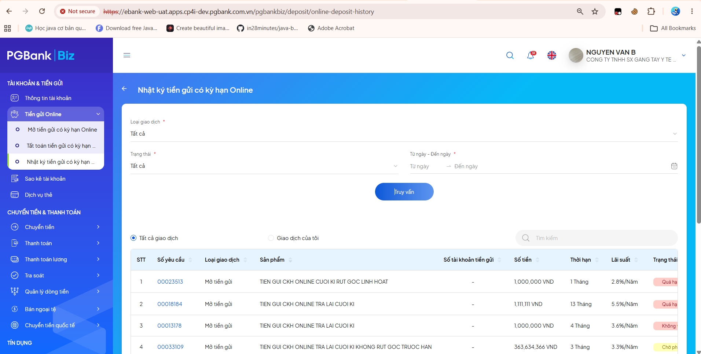

# Tunning SQL
### Nhật ký tiền gửi có kỳ hạn Online

```sql
    SELECT *
    FROM (
        SELECT d.*,
            ROW_NUMBER() OVER (ORDER BY UPDATE_TIME DESC NULLS LAST) AS rownum2
        FROM (
            SELECT ht.tran_sn AS tran_sn,
                ht.tr_core_sn AS core_sn,
                ht.user_id AS user_id,
                'OP' AS tran_type,
                ht.interest_receive_acct AS rollin_account_no,
                ht.ROLLOUT_ACCT_NO AS rollout_account_no,
                ht.receipt_no AS receipt_no,
                ht.acct_no AS account_no,
                ht.receipt_product_code AS receipt_product_code,

                (SELECT TRIM(',' FROM b.assignee)
                    FROM wf_log_info b
                    WHERE b.wf_process_id = ht.wf_process_id
                    AND b.status = 'processing') waiting,

                (SELECT RTRIM(EXTRACT(XMLAGG(XMLELEMENT("a", assignee || ',')), '//text()'), ',')
                    FROM wf_log_info b
                    WHERE b.wf_process_id = ht.wf_process_id
                    AND b.status = 'approve'
                    GROUP BY b.wf_process_id) approved,

                NVL(ht.amount, 0) amount,
                NVL(ht.fee, 0) fee,
                NVL(ht.vat, 0) vat,
                0 AS interest_amount,
                ht.status,
                ht.wf_status,

                (SELECT FULL_NAME FROM bb_user_info WHERE user_id = ht.create_by) AS create_by,

                ht.create_time,
                ht.update_by,
                ht.update_time,
                ht.channel_code,
                ht.checker_remark,
                '' AS settlement_type,
                0 interest_amount_payed,
                0 AS penalty_amount,
                ht.INTEREST_RATE AS interest_rate,
                ht.term_period AS TERM_PERIOD,
                ht.term_period AS term,
                ht.TERM_TYPE AS term_code,
                NULL AS maturity_date,
                NULL AS settlement_date,
                '' AS category,
                ht.currency_code AS currency_code,

                (SELECT user_name FROM bb_user_info WHERE user_id = ht.user_id) AS user_name,

                ht.interest_receive_acct,
                (SELECT b.opening_date FROM bk_receipt_info b WHERE ht.tran_sn = b.tran_sn) AS open_time,

                0 AS pre_balance,
                ht.core_resp,
                NULL AS is_rollout_interest,
                ht.IS_PLUS,
                ht.ACC_NAME,

                (SELECT h.apply_name
                    FROM wf_log_info h
                    WHERE h.wf_process_id = ht.wf_process_id
                    AND h.status = 'processing'
                    AND h.apply_name = 'task1'
                    AND ROWNUM = 1) apply_name,

                ht.AUTHEN_DEVICE,
                ht.AUTHEN_METHOD,

                (SELECT p.CATEGORY_NAME
                    FROM BK_CATEGORY_PRODUCT p
                    WHERE p.LANGUAGE = 'vi_VN'
                    AND p.CATEGORY_ID = ht.PRODUCT_TYPE
                    AND p.SYS_CODE = 'BB') PRODUCT_TYPE_NAME,

                ht.FORM_INTEREST_PAY,
                ht.IS_CIRCULAR,

                CASE
                    WHEN 'vi_VN' = 'vi_VN' THEN 'Mở tiền gửi'
                    ELSE 'Open deposit'
                END AS TRAN_TYPE_NAME_ORDER,

                (SELECT CASE
                            WHEN 'vi_VN' = 'vi_VN' THEN p.PRODUCT_NAME
                            ELSE p.PRODUCT_NAME_ENG
                        END
                    FROM BK_RECEIPT_PRODUCT_HDR p
                    WHERE p.PRODUCT_ID = ht.receipt_product_code
                    AND p.STATUS = 'ACTV'
                    AND ROWNUM = 1) PRODUCT_NAME_ORDER,

                '' AS RECEIPT_NO_ORDER,
                ht.REQUEST_ID,
                TO_CHAR(NVL(ht.amount, 0)) AS PRINCIPAL_AMOUNT,
                ht.CORP_ID

            FROM bb_saving_opening_history ht
            WHERE ht.status IS NOT NULL
            AND ((ht.ROLLOUT_ACCT_NO NOT IN ('8256169217865') OR ht.ROLLOUT_ACCT_NO IS NULL)
            AND (ht.ACCT_NO NOT IN ('8256169217865') OR ht.ACCT_NO IS NULL))
            AND ht.CORP_ID = 269884
            AND ht.STATUS IN ('NEWR','CKNG','CKRJ','SUCC','SMFL','EXPD','PTSM')

            UNION ALL

            SELECT d.TRAN_SN,
                d.CORE_SN,
                d.USER_ID,
                ('ST' || d.SETTLEMENT_METHOD),
                d.ROLLIN_ACCT_NO,
                NULL,
                d.SAVING_RECEIPT_NO,
                '',
                bs.product_code,

                (SELECT TRIM(',' FROM b.ASSIGNEE)
                    FROM WF_LOG_INFO b
                    WHERE b.WF_PROCESS_ID = d.WF_PROCESS_ID
                    AND b.STATUS = 'processing') waiting,

                (SELECT RTRIM(EXTRACT(XMLAGG(XMLELEMENT("a", assignee || ',')), '//text()'), ',')
                    FROM wf_log_info b
                    WHERE b.WF_PROCESS_ID = d.WF_PROCESS_ID
                    AND b.STATUS = 'approve'
                    GROUP BY b.WF_PROCESS_ID) approved,

                NVL(d.AMOUNT, 0),
                NVL(d.FEE, 0),
                NVL(d.VAT, 0),
                d.INTEREST_AMOUNT,
                d.STATUS,
                d.wf_status,

                (SELECT FULL_NAME FROM BB_USER_INFO WHERE USER_ID = d.CREATE_BY),

                d.CREATE_TIME,
                d.UPDATE_BY,
                d.UPDATE_TIME,
                d.CHANNEL_CODE,
                d.CHECKER_REMARK,
                d.SETTLEMENT_TYPE,

                NVL(bs.INTEREST_AMOUNT_PAYED, 0),
                0,
                bs.interest_rate,
                bs.term,
                bs.term,
                bs.term_code,
                bs.MATURITY_DATE,
                bs.SETTLEMENT_DATE,
                '',
                d.CURRENCY_CODE,

                (SELECT USER_NAME FROM BB_USER_INFO WHERE USER_ID = d.USER_ID),

                '',
                bs.OPENING_DATE,
                0,
                d.CORE_RESP,
                NULL,
                '',
                '',

                (SELECT h.apply_name
                    FROM wf_log_info h
                    WHERE h.wf_process_id = d.wf_process_id
                    AND h.status = 'processing'
                    AND h.apply_name = 'task1'
                    AND ROWNUM = 1),

                d.AUTHEN_DEVICE,
                d.AUTHEN_METHOD,

                (SELECT p.CATEGORY_NAME
                    FROM BK_CATEGORY_PRODUCT p
                    WHERE p.LANGUAGE = 'vi_VN'
                    AND p.CATEGORY_ID = bs.PRODUCT_TYPE
                    AND p.SYS_CODE = 'BB'),

                bs.FORM_INTEREST_PAY,
                bs.IS_CIRCULAR,

                CASE
                    WHEN 'vi_VN' = 'vi_VN' AND d.SETTLEMENT_METHOD = 'A' THEN 'Tất toán toàn bộ'
                    WHEN 'vi_VN' = 'vi_VN' AND d.SETTLEMENT_METHOD = 'P' THEN 'Tất toán một phần'
                    WHEN 'vi_VN' = 'en_US' AND d.SETTLEMENT_METHOD = 'A' THEN 'Full Settlement'
                    ELSE 'Partial Settlement'
                END,

                (SELECT CASE
                            WHEN 'vi_VN' = 'vi_VN' THEN p.PRODUCT_NAME
                            ELSE p.PRODUCT_NAME_ENG
                        END
                    FROM BK_RECEIPT_PRODUCT_HDR p
                    WHERE p.PRODUCT_ID = bs.product_code
                    AND p.STATUS = 'ACTV'
                    AND ROWNUM = 1),

                d.SAVING_RECEIPT_NO,
                d.REQUEST_ID,
                NVL(d.PRINCIPAL_AMOUNT, 0),
                d.CORP_ID

            FROM BB_SAVING_SETTLEMENT_HISTORY d
            JOIN BK_RECEIPT_INFO bs
            ON d.saving_receipt_no = bs.receipt_no
            AND d.tran_sn = bs.tran_sn
            WHERE d.status IS NOT NULL
            AND d.wf_process_id IS NOT NULL
            AND (d.SAVING_RECEIPT_NO NOT IN ('8256169217865') OR d.SAVING_RECEIPT_NO IS NULL)
            AND d.CORP_ID = 269884
            AND d.STATUS IN ('NEWR','CKNG','CKRJ','SUCC','SMFL','EXPD','PTSM')
            AND d.SETTLEMENT_METHOD IN ('A','P')

        ) d
    ) e
    WHERE e.rownum2 >= 1
    AND e.rownum2 <= 10;

    -- Index cũ đã đánh trước khi tunning
    CREATE INDEX "PGBANK_OWNER_UAT"."IDX_SAVING_OPEN_CORP_ST_UPD" ON "PGBANK_OWNER_UAT"."BB_SAVING_OPENING_HISTORY" ("CORP_ID", "STATUS", "UPDATE_TIME") 
    PCTFREE 10 INITRANS 2 MAXTRANS 255 COMPUTE STATISTICS 
    STORAGE(INITIAL 65536 NEXT 1048576 MINEXTENTS 1 MAXEXTENTS 2147483645
    PCTINCREASE 0 FREELISTS 1 FREELIST GROUPS 1
    BUFFER_POOL DEFAULT FLASH_CACHE DEFAULT CELL_FLASH_CACHE DEFAULT)
    TABLESPACE "EBANK_DATA" ;

    -- Index cũ đã đánh trước khi tunning
    CREATE INDEX "PGBANK_OWNER_UAT"."IDX_SAVING_SETTLE_CORP_ST_UPD" ON "PGBANK_OWNER_UAT"."BB_SAVING_SETTLEMENT_HISTORY" ("CORP_ID", "STATUS", "SETTLEMENT_METHOD", "UPDATE_TIME") 
    PCTFREE 10 INITRANS 2 MAXTRANS 255 COMPUTE STATISTICS 
    STORAGE(INITIAL 65536 NEXT 1048576 MINEXTENTS 1 MAXEXTENTS 2147483645
    PCTINCREASE 0 FREELISTS 1 FREELIST GROUPS 1
    BUFFER_POOL DEFAULT FLASH_CACHE DEFAULT CELL_FLASH_CACHE DEFAULT)
    TABLESPACE "EBANK_DATA" ;
```

* Trước khi tunning, explain plan
```
-----------------------------------------------------------------------------------------------------------------------------------------------------------------------
| Id  | Operation                                        | Name                          | Starts | E-Rows | A-Rows |   A-Time   | Buffers |  OMem |  1Mem | Used-Mem |
-----------------------------------------------------------------------------------------------------------------------------------------------------------------------
|   0 | SELECT STATEMENT                                 |                               |      1 |        |     10 |00:00:34.00 |    5594K|       |       |          |
|*  1 |  VIEW                                            |                               |      1 |     10 |     10 |00:00:34.00 |    5594K|       |       |          |
|*  2 |   WINDOW SORT PUSHED RANK                        |                               |      1 |     12 |     10 |00:00:34.00 |    5594K|  6144 |  6144 | 6144  (0)|
|   3 |    VIEW                                          |                               |      1 |     12 |     21 |00:00:34.00 |    5594K|       |       |          |
|   4 |     UNION-ALL                                    |                               |      1 |        |     21 |00:00:34.00 |    5594K|       |       |          |
|*  5 |      TABLE ACCESS FULL                           | WF_LOG_INFO                   |     12 |      1 |     10 |00:00:06.85 |    1112K|       |       |          |
|   6 |      SORT GROUP BY                               |                               |     12 |      1 |      1 |00:00:06.87 |    1112K|  2048 |  2048 |          |
|*  7 |       TABLE ACCESS FULL                          | WF_LOG_INFO                   |     12 |      1 |      1 |00:00:06.87 |    1112K|       |       |          |
|   8 |      TABLE ACCESS BY INDEX ROWID BATCHED         | BB_USER_INFO                  |      5 |      1 |      5 |00:00:00.01 |      12 |       |       |          |
|*  9 |       INDEX RANGE SCAN                           | BB_USER_INFO_PK               |      5 |      1 |      5 |00:00:00.01 |       7 |       |       |          |
|  10 |      TABLE ACCESS BY INDEX ROWID BATCHED         | BB_USER_INFO                  |      5 |      1 |      5 |00:00:00.01 |      12 |       |       |          |
|* 11 |       INDEX RANGE SCAN                           | BB_USER_INFO_PK               |      5 |      1 |      5 |00:00:00.01 |       7 |       |       |          |
|  12 |      TABLE ACCESS BY INDEX ROWID BATCHED         | BK_RECEIPT_INFO               |     12 |      1 |      0 |00:00:00.01 |      14 |       |       |          |
|* 13 |       INDEX RANGE SCAN                           | IDX_RECEIPT_INFO_TRAN         |     12 |      1 |      0 |00:00:00.01 |      14 |       |       |          |
|* 14 |      COUNT STOPKEY                               |                               |     12 |        |      9 |00:00:05.28 |     880K|       |       |          |
|* 15 |       TABLE ACCESS FULL                          | WF_LOG_INFO                   |     12 |      1 |      9 |00:00:05.28 |     880K|       |       |          |
|* 16 |      INDEX RANGE SCAN                            | IDX_CAT_PROD_LOOKUP           |      5 |      1 |      0 |00:00:00.01 |       2 |       |       |          |
|* 17 |      COUNT STOPKEY                               |                               |      5 |        |      4 |00:00:00.01 |       9 |       |       |          |
|  18 |       TABLE ACCESS BY INDEX ROWID BATCHED        | BK_RECEIPT_PRODUCT_HDR        |      5 |      1 |      4 |00:00:00.01 |       9 |       |       |          |
|* 19 |        INDEX RANGE SCAN                          | IDX_RCPT_PROD_HDR_ID_STATUS   |      5 |      1 |      4 |00:00:00.01 |       5 |       |       |          |
|* 20 |      TABLE ACCESS BY GLOBAL INDEX ROWID BATCHED  | BB_SAVING_OPENING_HISTORY     |      1 |      4 |     12 |00:00:00.01 |      12 |       |       |          |
|* 21 |       INDEX RANGE SCAN                           | IDX_SAVING_OPEN_CORP_ST_UPD   |      1 |      5 |     12 |00:00:00.01 |       2 |       |       |          |
|* 22 |      TABLE ACCESS FULL                           | WF_LOG_INFO                   |      9 |      1 |      3 |00:00:05.05 |     834K|       |       |          |
|  23 |      SORT GROUP BY                               |                               |      9 |      1 |      5 |00:00:05.06 |     834K|  2048 |  2048 | 2048  (0)|
|* 24 |       TABLE ACCESS FULL                          | WF_LOG_INFO                   |      9 |      1 |      5 |00:00:05.05 |     834K|       |       |          |
|  25 |      TABLE ACCESS BY INDEX ROWID BATCHED         | BB_USER_INFO                  |      3 |      1 |      3 |00:00:00.01 |       8 |       |       |          |
|* 26 |       INDEX RANGE SCAN                           | BB_USER_INFO_PK               |      3 |      1 |      3 |00:00:00.01 |       5 |       |       |          |
|  27 |      TABLE ACCESS BY INDEX ROWID BATCHED         | BB_USER_INFO                  |      3 |      1 |      3 |00:00:00.01 |       8 |       |       |          |
|* 28 |       INDEX RANGE SCAN                           | BB_USER_INFO_PK               |      3 |      1 |      3 |00:00:00.01 |       5 |       |       |          |
|* 29 |      COUNT STOPKEY                               |                               |      9 |        |      3 |00:00:04.88 |     818K|       |       |          |
|* 30 |       TABLE ACCESS FULL                          | WF_LOG_INFO                   |      9 |      1 |      3 |00:00:04.88 |     818K|       |       |          |
|* 31 |      INDEX RANGE SCAN                            | IDX_CAT_PROD_LOOKUP           |      1 |      1 |      0 |00:00:00.01 |       0 |       |       |          |
|* 32 |      COUNT STOPKEY                               |                               |      2 |        |      1 |00:00:00.01 |       3 |       |       |          |
|  33 |       TABLE ACCESS BY INDEX ROWID BATCHED        | BK_RECEIPT_PRODUCT_HDR        |      2 |      1 |      1 |00:00:00.01 |       3 |       |       |          |
|* 34 |        INDEX RANGE SCAN                          | IDX_RCPT_PROD_HDR_ID_STATUS   |      2 |      1 |      1 |00:00:00.01 |       2 |       |       |          |
|* 35 |      HASH JOIN                                   |                               |      1 |      8 |      9 |00:00:00.01 |      38 |   777K|   777K|  945K (0)|
|  36 |       INLIST ITERATOR                            |                               |      1 |        |      9 |00:00:00.01 |      15 |       |       |          |
|* 37 |        TABLE ACCESS BY GLOBAL INDEX ROWID BATCHED| BB_SAVING_SETTLEMENT_HISTORY  |      7 |      8 |      9 |00:00:00.01 |      15 |       |       |          |
|* 38 |         INDEX RANGE SCAN                         | IDX_SAVING_SETTLE_CORP_ST_UPD |      7 |      9 |      9 |00:00:00.01 |       8 |       |       |          |
|  39 |       TABLE ACCESS FULL                          | BK_RECEIPT_INFO               |      1 |    371 |    371 |00:00:00.01 |      23 |       |       |          |
-----------------------------------------------------------------------------------------------------------------------------------------------------------------------
 
Predicate Information (identified by operation id):
---------------------------------------------------
 
   1 - filter(("E"."ROWNUM2">=1 AND "E"."ROWNUM2"<=10))
   2 - filter(ROW_NUMBER() OVER ( ORDER BY INTERNAL_FUNCTION("UPDATE_TIME") DESC  NULLS LAST)<=10)
   5 - filter(("B"."WF_PROCESS_ID"=:B1 AND "B"."STATUS"='processing'))
   7 - filter(("B"."WF_PROCESS_ID"=:B1 AND "B"."STATUS"='approve'))
   9 - access("USER_ID"=:B1)
  11 - access("USER_ID"=:B1)
  13 - access("B"."TRAN_SN"=:B1)
  14 - filter(ROWNUM=1)
  15 - filter(("H"."WF_PROCESS_ID"=:B1 AND "H"."STATUS"='processing' AND "H"."APPLY_NAME"='task1'))
  16 - access("P"."CATEGORY_ID"=:B1 AND "P"."LANGUAGE"='vi_VN' AND "P"."SYS_CODE"='BB')
  17 - filter(ROWNUM=1)
  19 - access("P"."PRODUCT_ID"=:B1 AND "P"."STATUS"='ACTV')
  20 - filter((("HT"."ACCT_NO" IS NULL OR "HT"."ACCT_NO"<>'8256169217865') AND ("HT"."ROLLOUT_ACCT_NO"<>'8256169217865' OR "HT"."ROLLOUT_ACCT_NO" IS NULL)))
  21 - access("HT"."CORP_ID"=269884)
       filter((INTERNAL_FUNCTION("HT"."STATUS") AND "HT"."STATUS" IS NOT NULL))
  22 - filter(("B"."WF_PROCESS_ID"=:B1 AND "B"."STATUS"='processing'))
  24 - filter(("B"."WF_PROCESS_ID"=:B1 AND "B"."STATUS"='approve'))
  26 - access("USER_ID"=:B1)
  28 - access("USER_ID"=:B1)
  29 - filter(ROWNUM=1)
  30 - filter(("H"."WF_PROCESS_ID"=:B1 AND "H"."STATUS"='processing' AND "H"."APPLY_NAME"='task1'))
  31 - access("P"."CATEGORY_ID"=:B1 AND "P"."LANGUAGE"='vi_VN' AND "P"."SYS_CODE"='BB')
  32 - filter(ROWNUM=1)
  34 - access("P"."PRODUCT_ID"=:B1 AND "P"."STATUS"='ACTV')
  35 - access("D"."SAVING_RECEIPT_NO"="BS"."RECEIPT_NO" AND "D"."TRAN_SN"="BS"."TRAN_SN")
  37 - filter(("D"."WF_PROCESS_ID" IS NOT NULL AND ("D"."SAVING_RECEIPT_NO"<>'8256169217865' OR "D"."SAVING_RECEIPT_NO" IS NULL)))
  38 - access("D"."CORP_ID"=269884 AND (("D"."STATUS"='CKNG' OR "D"."STATUS"='CKRJ' OR "D"."STATUS"='EXPD' OR "D"."STATUS"='NEWR' OR "D"."STATUS"='PTSM' OR 
              "D"."STATUS"='SMFL' OR "D"."STATUS"='SUCC')))
       filter((INTERNAL_FUNCTION("D"."SETTLEMENT_METHOD") AND "D"."STATUS" IS NOT NULL))
```

* Đánh thêm Index bảng WF_LOG_INFO
```sql
    CREATE INDEX idx_wf_log_process_status ON wf_log_info(wf_process_id, status);
```
```
--------------------------------------------------------------------------------------------------------------------------------------------------------------------------------
| Id  | Operation                                        | Name                          | Starts | E-Rows | A-Rows |   A-Time   | Buffers | Reads  |  OMem |  1Mem | Used-Mem |
--------------------------------------------------------------------------------------------------------------------------------------------------------------------------------
|   0 | SELECT STATEMENT                                 |                               |      1 |        |     10 |00:00:00.01 |     303 |     19 |       |       |          |
|*  1 |  VIEW                                            |                               |      1 |     10 |     10 |00:00:00.01 |     303 |     19 |       |       |          |
|*  2 |   WINDOW SORT PUSHED RANK                        |                               |      1 |     12 |     10 |00:00:00.01 |     303 |     19 |  6144 |  6144 | 6144  (0)|
|   3 |    VIEW                                          |                               |      1 |     12 |     21 |00:00:00.01 |     303 |     19 |       |       |          |
|   4 |     UNION-ALL                                    |                               |      1 |        |     21 |00:00:00.01 |     303 |     19 |       |       |          |
|   5 |      TABLE ACCESS BY INDEX ROWID BATCHED         | WF_LOG_INFO                   |     12 |      1 |     10 |00:00:00.01 |      36 |     12 |       |       |          |
|*  6 |       INDEX RANGE SCAN                           | IDX_WF_LOG_PROCESS_STATUS     |     12 |      1 |     10 |00:00:00.01 |      26 |     12 |       |       |          |
|   7 |      SORT GROUP BY                               |                               |     12 |      1 |      1 |00:00:00.01 |      27 |      0 |  2048 |  2048 |          |
|   8 |       TABLE ACCESS BY INDEX ROWID                | WF_LOG_INFO                   |     12 |      1 |      1 |00:00:00.01 |      27 |      0 |       |       |          |
|*  9 |        INDEX RANGE SCAN                          | IDX_WF_LOG_PROCESS_STATUS     |     12 |      1 |      1 |00:00:00.01 |      26 |      0 |       |       |          |
|  10 |      TABLE ACCESS BY INDEX ROWID BATCHED         | BB_USER_INFO                  |      5 |      1 |      5 |00:00:00.01 |      12 |      0 |       |       |          |
|* 11 |       INDEX RANGE SCAN                           | BB_USER_INFO_PK               |      5 |      1 |      5 |00:00:00.01 |       7 |      0 |       |       |          |
|  12 |      TABLE ACCESS BY INDEX ROWID BATCHED         | BB_USER_INFO                  |      5 |      1 |      5 |00:00:00.01 |      12 |      0 |       |       |          |
|* 13 |       INDEX RANGE SCAN                           | BB_USER_INFO_PK               |      5 |      1 |      5 |00:00:00.01 |       7 |      0 |       |       |          |
|  14 |      TABLE ACCESS BY INDEX ROWID BATCHED         | BK_RECEIPT_INFO               |     12 |      1 |      0 |00:00:00.01 |      14 |      0 |       |       |          |
|* 15 |       INDEX RANGE SCAN                           | IDX_RECEIPT_INFO_TRAN         |     12 |      1 |      0 |00:00:00.01 |      14 |      0 |       |       |          |
|* 16 |      COUNT STOPKEY                               |                               |     12 |        |      9 |00:00:00.01 |      46 |      0 |       |       |          |
|* 17 |       TABLE ACCESS BY INDEX ROWID BATCHED        | WF_LOG_INFO                   |     12 |      1 |      9 |00:00:00.01 |      46 |      0 |       |       |          |
|* 18 |        INDEX RANGE SCAN                          | IDX_WF_LOG_PROCESS_STATUS     |     12 |      1 |     10 |00:00:00.01 |      36 |      0 |       |       |          |
|* 19 |      INDEX RANGE SCAN                            | IDX_CAT_PROD_LOOKUP           |      5 |      1 |      0 |00:00:00.01 |       2 |      0 |       |       |          |
|* 20 |      COUNT STOPKEY                               |                               |      5 |        |      4 |00:00:00.01 |       9 |      0 |       |       |          |
|  21 |       TABLE ACCESS BY INDEX ROWID BATCHED        | BK_RECEIPT_PRODUCT_HDR        |      5 |      1 |      4 |00:00:00.01 |       9 |      0 |       |       |          |
|* 22 |        INDEX RANGE SCAN                          | IDX_RCPT_PROD_HDR_ID_STATUS   |      5 |      1 |      4 |00:00:00.01 |       5 |      0 |       |       |          |
|* 23 |      TABLE ACCESS BY GLOBAL INDEX ROWID BATCHED  | BB_SAVING_OPENING_HISTORY     |      1 |      4 |     12 |00:00:00.01 |      12 |      0 |       |       |          |
|* 24 |       INDEX RANGE SCAN                           | IDX_SAVING_OPEN_CORP_ST_UPD   |      1 |      5 |     12 |00:00:00.01 |       2 |      0 |       |       |          |
|  25 |      TABLE ACCESS BY INDEX ROWID BATCHED         | WF_LOG_INFO                   |      9 |      1 |      3 |00:00:00.01 |      23 |      7 |       |       |          |
|* 26 |       INDEX RANGE SCAN                           | IDX_WF_LOG_PROCESS_STATUS     |      9 |      1 |      3 |00:00:00.01 |      20 |      7 |       |       |          |
|  27 |      SORT GROUP BY                               |                               |      9 |      1 |      5 |00:00:00.01 |      23 |      0 |  2048 |  2048 | 2048  (0)|
|  28 |       TABLE ACCESS BY INDEX ROWID                | WF_LOG_INFO                   |      9 |      1 |      5 |00:00:00.01 |      23 |      0 |       |       |          |
|* 29 |        INDEX RANGE SCAN                          | IDX_WF_LOG_PROCESS_STATUS     |      9 |      1 |      5 |00:00:00.01 |      20 |      0 |       |       |          |
|  30 |      TABLE ACCESS BY INDEX ROWID BATCHED         | BB_USER_INFO                  |      3 |      1 |      3 |00:00:00.01 |       8 |      0 |       |       |          |
|* 31 |       INDEX RANGE SCAN                           | BB_USER_INFO_PK               |      3 |      1 |      3 |00:00:00.01 |       5 |      0 |       |       |          |
|  32 |      TABLE ACCESS BY INDEX ROWID BATCHED         | BB_USER_INFO                  |      3 |      1 |      3 |00:00:00.01 |       8 |      0 |       |       |          |
|* 33 |       INDEX RANGE SCAN                           | BB_USER_INFO_PK               |      3 |      1 |      3 |00:00:00.01 |       5 |      0 |       |       |          |
|* 34 |      COUNT STOPKEY                               |                               |      9 |        |      3 |00:00:00.01 |      30 |      0 |       |       |          |
|* 35 |       TABLE ACCESS BY INDEX ROWID BATCHED        | WF_LOG_INFO                   |      9 |      1 |      3 |00:00:00.01 |      30 |      0 |       |       |          |
|* 36 |        INDEX RANGE SCAN                          | IDX_WF_LOG_PROCESS_STATUS     |      9 |      1 |      3 |00:00:00.01 |      27 |      0 |       |       |          |
|* 37 |      INDEX RANGE SCAN                            | IDX_CAT_PROD_LOOKUP           |      1 |      1 |      0 |00:00:00.01 |       0 |      0 |       |       |          |
|* 38 |      COUNT STOPKEY                               |                               |      2 |        |      1 |00:00:00.01 |       3 |      0 |       |       |          |
|  39 |       TABLE ACCESS BY INDEX ROWID BATCHED        | BK_RECEIPT_PRODUCT_HDR        |      2 |      1 |      1 |00:00:00.01 |       3 |      0 |       |       |          |
|* 40 |        INDEX RANGE SCAN                          | IDX_RCPT_PROD_HDR_ID_STATUS   |      2 |      1 |      1 |00:00:00.01 |       2 |      0 |       |       |          |
|* 41 |      HASH JOIN                                   |                               |      1 |      8 |      9 |00:00:00.01 |      38 |      0 |   777K|   777K|  934K (0)|
|  42 |       INLIST ITERATOR                            |                               |      1 |        |      9 |00:00:00.01 |      15 |      0 |       |       |          |
|* 43 |        TABLE ACCESS BY GLOBAL INDEX ROWID BATCHED| BB_SAVING_SETTLEMENT_HISTORY  |      7 |      8 |      9 |00:00:00.01 |      15 |      0 |       |       |          |
|* 44 |         INDEX RANGE SCAN                         | IDX_SAVING_SETTLE_CORP_ST_UPD |      7 |      9 |      9 |00:00:00.01 |       8 |      0 |       |       |          |
|  45 |       TABLE ACCESS FULL                          | BK_RECEIPT_INFO               |      1 |    371 |    371 |00:00:00.01 |      23 |      0 |       |       |          |
--------------------------------------------------------------------------------------------------------------------------------------------------------------------------------
 
Predicate Information (identified by operation id):
---------------------------------------------------
 
   1 - filter(("E"."ROWNUM2">=1 AND "E"."ROWNUM2"<=10))
   2 - filter(ROW_NUMBER() OVER ( ORDER BY INTERNAL_FUNCTION("UPDATE_TIME") DESC  NULLS LAST)<=10)
   6 - access("B"."WF_PROCESS_ID"=:B1 AND "B"."STATUS"='processing')
   9 - access("B"."WF_PROCESS_ID"=:B1 AND "B"."STATUS"='approve')
  11 - access("USER_ID"=:B1)
  13 - access("USER_ID"=:B1)
  15 - access("B"."TRAN_SN"=:B1)
  16 - filter(ROWNUM=1)
  17 - filter("H"."APPLY_NAME"='task1')
  18 - access("H"."WF_PROCESS_ID"=:B1 AND "H"."STATUS"='processing')
  19 - access("P"."CATEGORY_ID"=:B1 AND "P"."LANGUAGE"='vi_VN' AND "P"."SYS_CODE"='BB')
  20 - filter(ROWNUM=1)
  22 - access("P"."PRODUCT_ID"=:B1 AND "P"."STATUS"='ACTV')
  23 - filter((("HT"."ACCT_NO" IS NULL OR "HT"."ACCT_NO"<>'8256169217865') AND ("HT"."ROLLOUT_ACCT_NO"<>'8256169217865' OR "HT"."ROLLOUT_ACCT_NO" IS NULL)))
  24 - access("HT"."CORP_ID"=269884)
       filter((INTERNAL_FUNCTION("HT"."STATUS") AND "HT"."STATUS" IS NOT NULL))
  26 - access("B"."WF_PROCESS_ID"=:B1 AND "B"."STATUS"='processing')
  29 - access("B"."WF_PROCESS_ID"=:B1 AND "B"."STATUS"='approve')
  31 - access("USER_ID"=:B1)
  33 - access("USER_ID"=:B1)
  34 - filter(ROWNUM=1)
  35 - filter("H"."APPLY_NAME"='task1')
  36 - access("H"."WF_PROCESS_ID"=:B1 AND "H"."STATUS"='processing')
  37 - access("P"."CATEGORY_ID"=:B1 AND "P"."LANGUAGE"='vi_VN' AND "P"."SYS_CODE"='BB')
  38 - filter(ROWNUM=1)
  40 - access("P"."PRODUCT_ID"=:B1 AND "P"."STATUS"='ACTV')
  41 - access("D"."SAVING_RECEIPT_NO"="BS"."RECEIPT_NO" AND "D"."TRAN_SN"="BS"."TRAN_SN")
  43 - filter(("D"."WF_PROCESS_ID" IS NOT NULL AND ("D"."SAVING_RECEIPT_NO"<>'8256169217865' OR "D"."SAVING_RECEIPT_NO" IS NULL)))
  44 - access("D"."CORP_ID"=269884 AND (("D"."STATUS"='CKNG' OR "D"."STATUS"='CKRJ' OR "D"."STATUS"='EXPD' OR "D"."STATUS"='NEWR' OR "D"."STATUS"='PTSM' OR 
              "D"."STATUS"='SMFL' OR "D"."STATUS"='SUCC')))
       filter((INTERNAL_FUNCTION("D"."SETTLEMENT_METHOD") AND "D"."STATUS" IS NOT NULL))
```